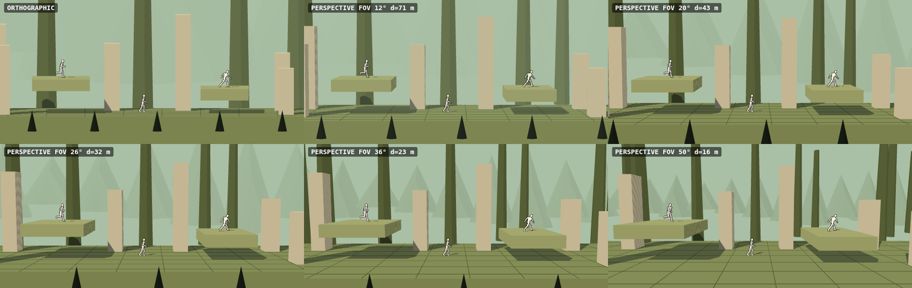

# Dirección de arte

> Palabra clave: **STYLIZED 3D SIDE-SCROLLING ADVENTURE**. Identidad propia: no «Zelda en 2D», no «Hades con
> otro personaje», no «Castlevania con gráficos 3D». Las referencias aportan **principios**, nunca contenido.

> ⚠️ **Obsoleto (2026-10-05).** Esta dirección (3D estilizado; referencias Zelda / Hades / Castlevania) fue sustituida por el brief 2D:
> referencias Hollow Knight + Solo Leveling, protagonista chibi con energía **roja**, enemigos de tinta negra con aura **violeta** al
> cargar. La nueva biblia de arte llegará con el Prompt 3; mientras tanto, lo aprendido de las imágenes está en
> [AUDIT-2026-10 §6](AUDIT-2026-10.md). Se conserva el principio de «referencias = principios, nunca contenido».

## 1. Qué se toma de cada referencia (y qué no)

| Referencia | Principio que adoptamos | No se copia |
|---|---|---|
| Zelda BotW / TotK | Sensación de mundo previo al jugador, naturaleza fundida con ruinas, escala, luz natural, materiales estilizados simples, bioma por región | Diseños, formas, símbolos, mapas, criaturas, UI |
| Hades / Hades II | Legibilidad a escala pequeña, siluetas fuertes, acentos de color sobre fondos contenidos, FX de ataque muy visibles, poses exageradas, luz dramática | Estética griega, personajes, iconografía, UI |
| Castlevania: Belmont's Curse | Estructura de acción-exploración lateral, salas, secretos, trampas, jefes, ritmo de combate, contraste entre ambientes | Gótico obligatorio, arquitectura/enemigos/armas/lore |

## 2. Lectura de las capturas de referencia aportadas (medidas, no para copiar)

Medido sobre las 5 capturas (alto útil ≈ 1120 px):

- El personaje ocupa **≈ 9 %** del alto visible; el jefe ≈ **2.5×** el jugador; puertas/pilares ≈ **7×**.
  → Nuestro objetivo: jugador **10–12 %** del alto visible (≈ 15–16 m de alto de visión con un jugador de 1.8 m) y se
  valida en 844×390 antes de tocar la escala.
- **Un matiz dominante por sala** (verde-azulado, amarillo-verdoso, carmesí) y los actores son **más cálidos y
  saturados** que su entorno → contraste cromático figura/fondo.
- **Siluetas negras en primer plano** (goteras arriba, hierba/rejas abajo) enmarcan la pantalla en los
  **bordes**, nunca en el centro de la acción.
- **Luz motivada**: velas con halo circular, haces por ventanas, cascadas emisivas, reflejo en agua,
  motas de polvo. Todo apoya la lectura del plano jugable.
- HUD mínimo arriba-izquierda, barra de jefe abajo-centro, textos contextuales abajo-centro.
  → Nuestra UI es **provisional y propia**, hecha para ser sustituida por PNG.
- FX de ataque amplios (arcos azules/dorados), números de daño flotantes, destellos de impacto.

## 3. Reglas de legibilidad (obligatorias)

Jerarquía de valor/saturación, de más a menos llamativo:

1. **Jugador** — el más luminoso (blanco) + *rim light* + contorno fino oscuro.
2. **Amenazas** (enemigos, proyectiles, telegraphs) — acento saturado propio por rol y *flash* de aviso.
3. **Interactivos** (checkpoint, pickups, gates, paredes rompibles) — emisivos suaves y pulso.
4. **Plano de juego** (suelo, plataformas) — valor medio, bordes superiores claros (silueta del camino).
5. **Fondos** — desaturados y velados por niebla atmosférica; **primer plano** — oscuro, solo en los bordes.

Prueba obligatoria: captura a 844×390 y preguntarse *¿se entiende qué hace el personaje?* Si no: más
contraste/silueta/FX/luz, **no** más tamaño de personaje.

Roles de color de actores: jugador blanco · pequeño ámbar · pesado carmesí · volador violeta · a distancia
turquesa · mini-jefe cobre · jefe magenta/oro. Los fondos nunca usan esos tonos con esa saturación.

## 4. Color script por región (provisional)

| Región | Dominante | Luz | Acento |
|---|---|---|---|
| Ancient Forest Ruins — exterior | verdes + tierra + dorados | cálida, oblicua, motas de polvo | piedra clara |
| Ruins (interior) | piedra + verdes apagados | cálida localizada | musgo luminoso |
| Root Cavern | azules / ocres | luces puntuales (cristales, brasas) | turquesa emisivo |
| Arenas (mini-jefe / jefe) | piedra + dorado | cenital dramática, contraste alto | acento del jefe |
| Corrupción (futuro) | oscuros | baja | magenta saturado |

## 5. Capas de profundidad

`FAR` (z −60…−200: montañas, ruinas gigantes, cielo) · `MID` (z −10…−40: árboles, arcos, muros) ·
`WORLD` (z −4…+3: plano de juego y su volumen) · `FOREGROUND` (z +3…+10: ramas, hojas, piedras;
**solo bordes superior/inferior**, oscuros y poco densos) · `ATMOSPHERE` (niebla, haces de luz, polvo, luciérnagas).
El parallax sale gratis de una cámara en perspectiva real; nada se «simula» con sprites desplazados.

## 6. Luz

Una direccional con sombra (clave, sigue al jugador para sombra nítida), hemisférica por región, *rim* en el
shader de personajes (separación garantizada independientemente de la escena), luces puntuales ≤ 3
(brazas, cristales) y emisivos + halos aditivos para el resto. **Nunca** un filtro oscuro uniforme.

## 7. Materiales

Toon de 3–4 tonos con rampa por región, vértice coloreado para variación y «AO» barato (oscuro abajo, musgo en
las caras superiores), roughness controlada. Piedra, madera, vegetación y metal se distinguen por valor y
rampa, no por texturas fotográficas. Todo comparte el mismo lenguaje.

## 8. Cámara — estudio y decisión (F4)

La misma escena (capas FAR/MID/WORLD/FOREGROUND, plataformas con volumen, pilares que cruzan el plano de juego, tres
maniquís) renderizada por `CameraRig` con **idéntico centro y altura visible (15 m)**, de modo que solo cambia la
proyección. Reproducible con `?lab=camera` (`&cells=ortho,20,26`).

| Proyección | Lo que se ve | Veredicto |
|---|---|---|
| Ortográfica | Sin caras laterales, suelo como banda plana, nada de convergencia. Parece un 2D con modelos 3D. | ✗ incumple «no quiero 2D puro» |
| Perspectiva 12° | Casi ortográfica; apenas hay profundidad. | ✗ |
| Perspectiva 20° | Caras laterales visibles, suelo con fuga suave, cero deformación de personajes. | ✔ válida (arenas, salas planas) |
| **Perspectiva 26°** | Volumen claro en plataformas y pilares, suelo que se aleja, parallax entre capas, personajes del borde sin deformación apreciable. | ✔ **por defecto** |
| Perspectiva 36° | Pilares inclinados, personajes de los bordes empiezan a deformarse. | ⚠ solo para momentos cinematográficos |
| Perspectiva 50° | Plataformas torcidas, el plano jugable deja de leerse como lateral. | ✗ |

**Decisión:** perspectiva con **FOV vertical 26°** y **pitch 3.5°**, `viewHeight = 15 m`. Razones: (1) el parallax y el
volumen salen de la geometría real, sin trucos; (2) a 26° un personaje en el borde de una pantalla 20:9 se ve a ≈ 24°
fuera de eje: sigue leyéndose «de lado»; (3) la proyección es solo una decisión artística porque el rig fija la altura
visible en el plano de juego: cambiarla **no** altera el tamaño del jugador ni cuánto nivel se ve.
Cambia por sala (`RoomDefinition.camera`) o por URL para probar en el móvil: `?fov=20`, `?cam=ortho`, `?vh=18`.

Nota de legibilidad descubierta en el estudio: un maniquí blanco en sombra caía a gris oscuro (~30 %).
Los personajes llevan un **suelo de luz** (`look.lightFloor`, 0.5 por defecto) para que nunca se hundan en el fondo.

## 9. Criterio visual final (checklist antes de dar por buena una decisión visual)

- ¿Ayuda a crear un mundo de aventura estilizado y cinematográfico?
- ¿El personaje sigue siendo legible? ¿Los enemigos se distinguen?
- ¿El escenario tiene profundidad? ¿Los colores tienen intención?
- ¿La luz ayuda al gameplay? ¿Los VFX tienen impacto?
- ¿Se siente bien en una pantalla de teléfono?
- ¿Se parece demasiado a una referencia concreta? → cambiarlo.
